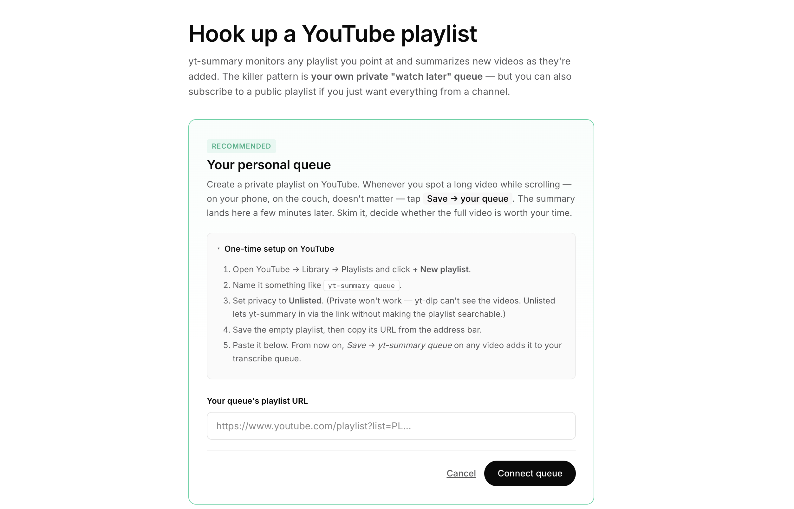
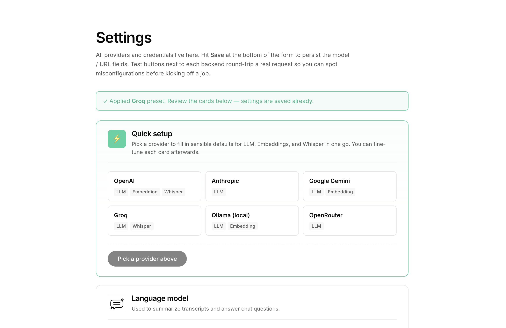

# yt-summary

> **Watch later, but smart.**
> A self-hosted YouTube summarizer that turns "save for later" into "skim later, watch only the worthwhile ones."

[](https://github.com/stefan-kp/yt-summary/actions)
[](LICENSE)

## The killer use case

Make a private YouTube playlist. While you scroll through YouTube on your
phone or couch, hit **Save → your queue** on anything that looks too long
to commit to right now. yt-summary picks it up, transcribes it, summarizes
it. A few minutes later you skim the summary, then decide whether the
full video is actually worth your time.

Your watch-later list, but with a real cost-of-watching filter on top.



It also works on:
- single YouTube URLs (the classic use case)
- web articles (anything readable, paywalls willing)
- public playlists (auto-summarize new uploads from a channel)

## Quick start

```bash
git clone https://github.com/stefan-kp/yt-summary.git
cd yt-summary
docker compose -f docker/docker-compose.yml up -d
```

Open <http://localhost:8200>, click the gear icon, and either:

- **Use Quick Setup** — pick a provider (OpenAI / Anthropic / Gemini /
  Groq / Ollama / OpenRouter), paste an API key, click Apply. LLM,
  embeddings, and Whisper are all configured in one go.
- **Set everything manually** in the cards below.

Then **+ Set up your queue** on the home page, follow the on-screen
instructions to make an unlisted YouTube playlist, and start saving
videos to it.

> Container exposes its uvicorn on `:8000`; the compose file maps host
> port `8200` to it. If you run yt-summary outside Docker, uvicorn
> defaults to `:8000`.

## What it does

| Feature | Notes |
|---|---|
| YouTube → transcript → summary | Tries YouTube subtitles first, falls back to Whisper if unavailable |
| Web articles | trafilatura-based readability extractor for any article URL |
| Personal queue / playlist subscriptions | Scheduler re-checks every hour for new videos in subscribed playlists |
| Hybrid search | SQLite FTS5 + vector embeddings via `sqlite-vec`, ranked with Reciprocal Rank Fusion |
| Chat over a video | Ask follow-up questions; the transcript is the context |
| Tags | Pulled from yt-dlp metadata, surfaced as filterable pills |
| REST API + MCP server | One API key gates both. Use it from Claude Desktop, scripts, anything |
| Settings test buttons | Round-trip a real request to LLM / Whisper / embedding backend before kicking off a job |

## Provider Quick Setup



The Quick Setup wizard at the top of `/settings` covers six provider
families with curated defaults:

| Provider | LLM default | Embedding | Whisper |
|---|---|---|---|
| **OpenAI** | gpt-4o | text-embedding-3-small | whisper-1 |
| **Anthropic** | claude-sonnet-4-6 | — *(no embedding API)* | — |
| **Google Gemini** | gemini-2.5-flash | text-embedding-004 | — |
| **Groq** | Kimi K2 Instruct | — | whisper-large-v3 *(fastest)* |
| **Ollama** | llama3.1 | nomic-embed-text | — |
| **OpenRouter** | anthropic/claude-sonnet-4 | — | — |

For Ollama, the wizard reads `/api/tags` from your server and shows
a real dropdown of pulled models, split into chat and embedding lists.

Mix-and-match works: pick Anthropic for the LLM, then go to the
Embedding card and configure Ollama or OpenAI for embeddings.

## Whisper backends

A 1-hour video on a Pi5 with `small` Whisper takes ~1 hour to transcribe.
That's fine for "kick off and forget" but uncomfortable if you're
waiting for it. Four backends are supported:

1. **Local in container** *(default)* — `faster-whisper` on CPU. Drop
   model to `base` if `small` is too slow.
2. **Self-hosted faster-whisper-server** — run Docker on a Mac mini or
   beefier box, point yt-summary at its `/v1` endpoint.
3. **Groq Cloud** — `whisper-large-v3` at ~150× realtime, ~$0.04 per
   audio-hour. The fastest option by far.
4. **OpenAI Cloud** — `whisper-1`.

Set Whisper Base URL + (optionally) API key in Settings → Whisper card.
Each is OpenAI-API-compatible, so the same code path drives all three
hosted variants.

## Programmatic access

Generate an API key in Settings → "API access". The same key gates
both surfaces:

### REST API

Swagger UI: `http://localhost:8200/docs`

```bash
curl -X POST http://localhost:8200/api/v1/videos \
  -H "Authorization: Bearer yts_..." \
  -H "Content-Type: application/json" \
  -d '{"url":"https://youtu.be/dQw4w9WgXcQ"}'
```

### MCP server

Endpoint: `http://localhost:8200/mcp/sse`

For Claude Desktop:
```json
{
  "mcpServers": {
    "yt-summary": {
      "command": "npx",
      "args": [
        "-y", "mcp-remote",
        "http://your-host:8200/mcp/sse",
        "--header", "Authorization: Bearer yts_..."
      ]
    }
  }
}
```

Claude Code and other MCP-over-HTTP-capable hosts connect directly,
no `mcp-remote` needed. Tools exposed: `submit_url`, `search`,
`get_summary`, `get_transcript`, `ask_video`, `list_recent`.

## Development

```bash
pip install -e ".[dev]"
YTS_DATA_DIR=./data uvicorn app.main:app --reload
pytest
ruff check app tests
```

Tests run against an in-memory SQLite + sqlite-vec — no live LLM
calls. CI on every push runs the suite under Python 3.12 + builds a
multi-arch (amd64 + arm64) Docker image to GHCR.

## Architecture

- **FastAPI + Jinja2 + HTMX** — server-rendered, no JS framework
- **SQLite** with `sqlite-vec` extension for vector search
- **LiteLLM** for provider-agnostic LLM and embedding calls
- **yt-dlp + faster-whisper** for transcript acquisition
- **trafilatura** for web article extraction
- **Repository pattern**: routes → services → repos → DB

Specs live under `docs/superpowers/specs/`. The
[core design spec](docs/superpowers/specs/2026-05-05-yt-summary-design.md)
is the place to start; later specs cover playlists, the API, embedding
search, and the Quick Setup wizard.

## License

[MIT](LICENSE) — do whatever you want, just don't sue me.
