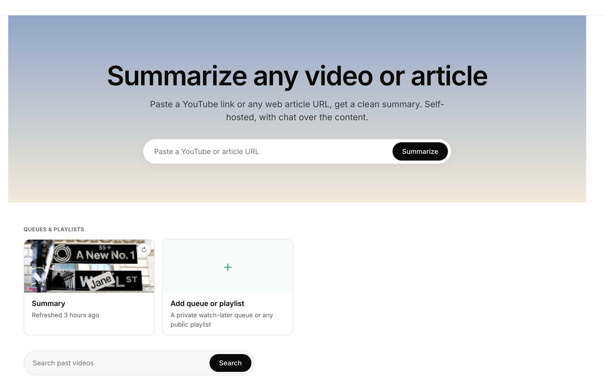

# yt-summary

> **Watch later, but smart.**
> A self-hosted YouTube summarizer that turns "save for later" into "skim later, watch only the worthwhile ones."

[](https://github.com/mycelos-ai/yt-summary/actions)
[](LICENSE)

[](https://www.youtube.com/watch?v=uqTZVZ70Mpc)

> ▶ [4-minute walkthrough](https://www.youtube.com/watch?v=uqTZVZ70Mpc) — install, onboarding, the killer playlist move, profiles, all of it.
> Or the [60-second teaser](https://www.youtube.com/watch?v=wUkqSNn63Hk) if you're in a hurry.



## The killer use case

Make an unlisted YouTube playlist. While you scroll through YouTube on
your phone or couch, hit the ⋯ menu on anything that looks too long
to commit to right now and pick **Save to playlist** → your playlist.
yt-summary picks it up, transcribes it, summarizes it. A few minutes
later you skim the summary, then decide whether the full video is
actually worth your time.

Your watch-later list, but with a real cost-of-watching filter on top —
and the summary lives in yt-summary, not on YouTube.


It also works on:
- single YouTube URLs (the classic use case)
- web articles (anything readable, paywalls willing)
- public playlists (auto-summarize new uploads from a channel)
- newsletters (point it at a dedicated mailbox over IMAP, pick which
  senders to follow, and it pulls, de-cruds, and summarizes their issues
  automatically)

And it learns. Highlight a passage in any summary and mark it 👍 / 👎 —
each profile builds an **interest profile** that shapes future summaries
and feeds a **daily digest** of the day's most relevant highlights.
Multiple profiles share one box, Netflix-style, each with its own queue,
interests, and digest.

## Quick start

One command, no git clone, no manual editing:

```bash
curl -fsSL mycelos.com/yt-summary/install.sh | sh
```

That redirects to the install script on GitHub, fetches
`docker-compose.yml` into `~/yt-summary/`, pulls the prebuilt image
from GHCR, and starts the container.

Don't trust the redirect? Use the GitHub URL directly:

```bash
curl -fsSL https://raw.githubusercontent.com/mycelos-ai/yt-summary/main/install.sh | sh
```

Prefer to read the script first?

```bash
curl -O https://raw.githubusercontent.com/mycelos-ai/yt-summary/main/install.sh
sh install.sh
```

Install somewhere other than `~/yt-summary` with `YTS_DIR`:

```bash
YTS_DIR=/opt/yt-summary curl -fsSL mycelos.com/yt-summary/install.sh | sh
```

### Updating

Re-run the same one-liner to update. The script detects an existing
install, refreshes `docker-compose.yml`, pulls the latest image
from GHCR, and recreates the container only if the image actually
changed. Your data in `~/yt-summary/data/` is untouched.

```bash
curl -fsSL mycelos.com/yt-summary/install.sh | sh
```

After `up -d`, the script polls `/api/v1/health` for ~20 seconds
and reports back. If the app doesn't respond, you get the exact
commands to inspect the container.

Open <http://localhost:8200>, click the gear icon, and either:

- **Use Quick Setup** — pick a provider (OpenAI / Anthropic / Gemini /
  Groq / Ollama / OpenRouter), paste an API key, click Apply. LLM,
  embeddings, and Whisper are all configured in one go.
- **Set everything manually** in the cards below.

Then **+ Set up your queue** on the home page, follow the on-screen
instructions to make an unlisted YouTube playlist, and start saving
videos to it.

> Container exposes its uvicorn on `:8000`; the compose file maps host
> port `8200` to it. If you run yt-summary outside Docker, uvicorn
> defaults to `:8000`.

### Behind a reverse proxy (HTTPS)

yt-summary is meant to live on your LAN; if you want to front it with
Caddy / nginx / Traefik / Cloudflare Tunnel for HTTPS, the image is
already proxy-aware — uvicorn is started with `--proxy-headers
--forwarded-allow-ips=*` so it honours the standard
`X-Forwarded-Proto` / `X-Forwarded-Host` headers your proxy sets.
Without that, absolute URLs in the rendered HTML come out as `http://…`
and the browser blocks them as Mixed Content when you reach the app
over HTTPS — assets disappear, HTMX swaps break.

If you override `command:` in your own compose file, **keep those two
uvicorn flags** or you'll hit the Mixed-Content trap.

Minimal Caddy example (`Caddyfile`):

```
yt-summary.example.com {
    reverse_proxy localhost:8200
}
```

That's it — Caddy sets the forwarded headers correctly out of the box.

## What it does

| Feature | Notes |
|---|---|
| YouTube → transcript → summary | Tries YouTube subtitles first, falls back to Whisper if unavailable |
| Web articles | trafilatura-based readability extractor for any article URL. For a paywalled article you subscribe to, paste a "Copy as cURL" command instead of the URL — yt-summary reads the URL, cookies, and headers out of it and fetches the page with your session. Cookies are used for that one fetch only, never stored |
| Newsletters (IMAP) | Per-profile mailbox polled on the scheduler tick. Strictly opt-in: scan the recent senders and subscribe to the ones you want (the rest, incl. spam, are ignored). HTML is pre-cleaned (tracking pixels, hidden pre-headers, footers stripped) before a newsletter-tuned summary; sender becomes a filter tag. Connect the mailbox on the profile page; pick senders under "Add a source" → Newsletter. Register your own addresses on the profile page to **forward** any newsletter (or one-off article) into the mailbox: it's always summarized and unwrapped to the original sender, which then shows up as a subscribe candidate. |
| Personal queue / playlist subscriptions | Scheduler re-checks every hour for new videos in subscribed playlists |
| Daily digest | Per-profile, scheduled (and on-demand): a TL;DR of the day's thematic clusters plus the Top 10 highlights, each with a "why this matters for you" line. Surfaced as a card strip on the home page |
| Highlight feedback → interest profile | Select text in any summary / transcript / digest, mark 👍 / 👎 or leave a comment. A per-profile Markdown interest profile is consolidated from the feedback trail and folded into every future summary and digest. Editable by hand on the profile page |
| Multiple profiles | Netflix-style profiles on one box — each with its own queue, sources, interest profile, digest, and settings |
| Hybrid search | SQLite FTS5 + vector embeddings via `sqlite-vec`, ranked with Reciprocal Rank Fusion |
| Chat over a video | Ask follow-up questions; the transcript is the context. Compact model selector to retry an answer with a stronger model |
| Multi-model re-summarize | Configure N LLM models in Settings, mark one default. Re-summarize any item with a different model and an optional one-shot instruction ("shorter", "focus on the frameworks") without touching the global default |
| Tags | Pulled from yt-dlp metadata, surfaced as filterable pills |
| REST API + MCP server | One API key gates both. Use it from Claude Desktop, scripts, anything |
| Settings test buttons | Round-trip a real request to LLM / Whisper / embedding backend before kicking off a job |
| Audio rendering | Render any summary or transcript to MP3 via local Piper TTS, optionally translating into German / English (US/GB) / French / Spanish first |

## Provider Quick Setup


The Quick Setup wizard at the top of `/settings` covers six provider
families with curated defaults:

| Provider | LLM default | Embedding | Whisper |
|---|---|---|---|
| **OpenAI** | gpt-4o | text-embedding-3-small | whisper-1 |
| **Anthropic** | claude-sonnet-4-6 | — *(no embedding API)* | — |
| **Google Gemini** | gemini-2.5-flash | text-embedding-004 | — |
| **Groq** | Kimi K2 Instruct | — | whisper-large-v3 *(fastest)* |
| **Ollama** | llama3.1 | nomic-embed-text | — |
| **OpenRouter** | anthropic/claude-sonnet-4 | — | — |

For Ollama, the wizard reads `/api/tags` from your server and shows
a real dropdown of pulled models, split into chat and embedding lists.

Mix-and-match works: pick Anthropic for the LLM, then go to the
Embedding card and configure Ollama or OpenAI for embeddings.

## Whisper backends

A 1-hour video on a Pi5 with `small` Whisper takes ~1 hour to transcribe.
That's fine for "kick off and forget" but uncomfortable if you're
waiting for it. Four backends are supported:

1. **Local in container** *(default)* — `faster-whisper` on CPU. Drop
   model to `base` if `small` is too slow.
2. **Self-hosted faster-whisper-server** — run Docker on a Mac mini or
   beefier box, point yt-summary at its `/v1` endpoint.
3. **Groq Cloud** — `whisper-large-v3` at ~150× realtime, ~$0.04 per
   audio-hour. The fastest option by far.
4. **OpenAI Cloud** — `whisper-1`.

Set Whisper Base URL + (optionally) API key in Settings → Whisper card.
Each is OpenAI-API-compatible, so the same code path drives all three
hosted variants.

## Audio (TTS)

Generate an MP3 from any summary or transcript, in any of five
languages, without leaving the Pi:

1. Open a video detail page, click **🔊 Audio**
2. Pick source (summary / transcript), language, voice, quality
3. Wait for the render — the modal polls for progress
4. Listen in the browser or download the MP3

The first time you pick a new voice, the model file (~80 MB
medium, ~130 MB high) downloads from Hugging Face into
`data/tts-voices/`. Subsequent renders are local-only.

Translation reuses your already-configured LLM provider — no
extra credentials. Chunked with overlap context to keep
terminology consistent across long transcripts.

| Voice family            | Languages | Notes              |
|-------------------------|-----------|--------------------|
| Thorsten / Kerstin      | DE        | Including emotional|
| Lessac / Amy / Ryan     | en_US     |                    |
| Alba / Southern English | en_GB     |                    |
| Siwis                   | FR        |                    |
| Sharvard                | ES        |                    |

Cloud TTS providers are not (yet) supported — Piper is good
enough for the use case and removes a second API-key dependency.

## Programmatic access

Generate an API key in Settings → "API access". The same key gates
both surfaces:

### REST API

Swagger UI: `http://localhost:8200/docs`

```bash
curl -X POST http://localhost:8200/api/v1/videos \
  -H "Authorization: Bearer yts_..." \
  -H "Content-Type: application/json" \
  -d '{"url":"https://youtu.be/dQw4w9WgXcQ"}'
```

### MCP server

Endpoint: `http://localhost:8200/mcp/sse`

For Claude Desktop:
```json
{
  "mcpServers": {
    "yt-summary": {
      "command": "npx",
      "args": [
        "-y", "mcp-remote",
        "http://your-host:8200/mcp/sse",
        "--header", "Authorization: Bearer yts_..."
      ]
    }
  }
}
```

Claude Code and other MCP-over-HTTP-capable hosts connect directly,
no `mcp-remote` needed. Tools exposed: `submit_url`, `search`,
`get_summary`, `get_transcript`, `ask_video`, `list_recent`,
`list_models`, `resummarize`.

## Development

```bash
pip install -e ".[dev]"
YTS_DATA_DIR=./data uvicorn app.main:app --reload
pytest
ruff check app tests
```

Tests run against an in-memory SQLite + sqlite-vec — no live LLM
calls. CI on every push runs the suite under Python 3.12 + builds a
multi-arch (amd64 + arm64) Docker image to GHCR.

## Architecture

- **FastAPI + Jinja2 + HTMX** — server-rendered, no JS framework
- **SQLite** with `sqlite-vec` extension for vector search
- **LiteLLM** for provider-agnostic LLM and embedding calls
- **yt-dlp + faster-whisper** for transcript acquisition
- **trafilatura** for web article extraction
- **Repository pattern**: routes → services → repos → DB

Specs live under `docs/superpowers/specs/`. The
[core design spec](docs/superpowers/specs/2026-05-05-yt-summary-design.md)
is the place to start; later specs cover playlists, the API, embedding
search, the Quick Setup wizard, newsletter aggregation, multi-model
re-summary, and the daily digest + interest-profile feedback loop.

## License

[MIT](LICENSE) — do whatever you want, just don't sue me.

